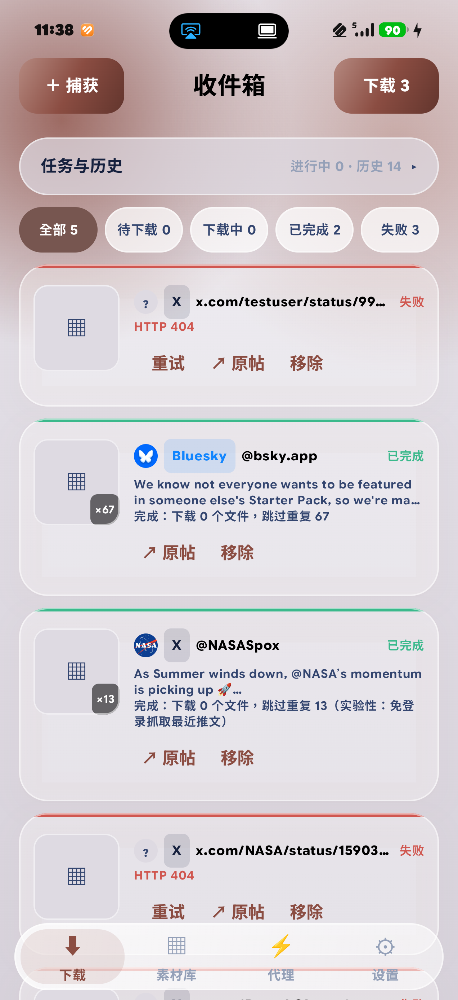
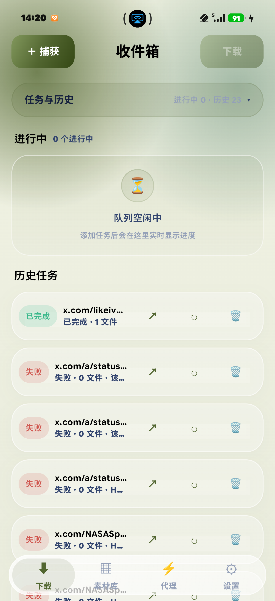
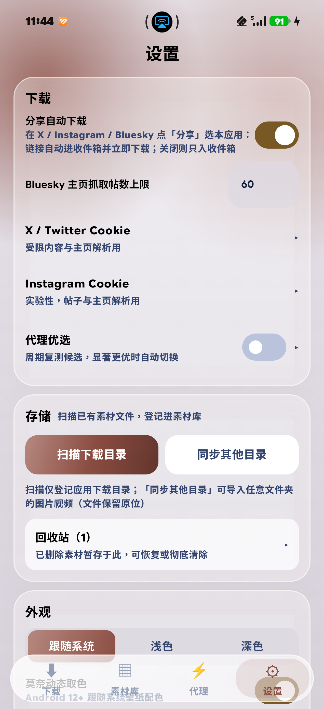
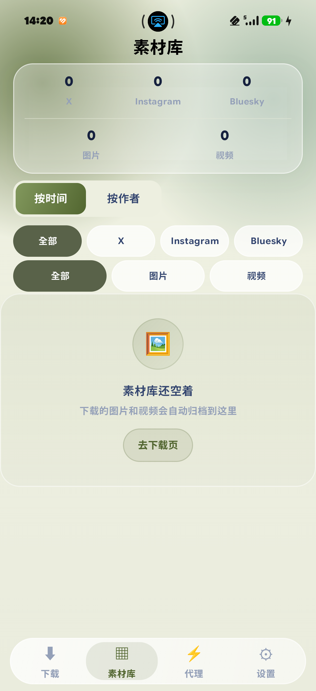
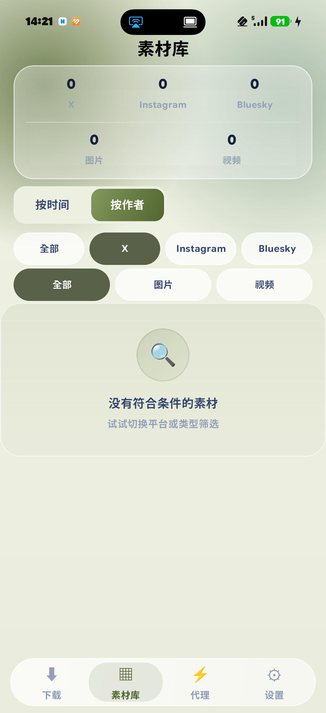
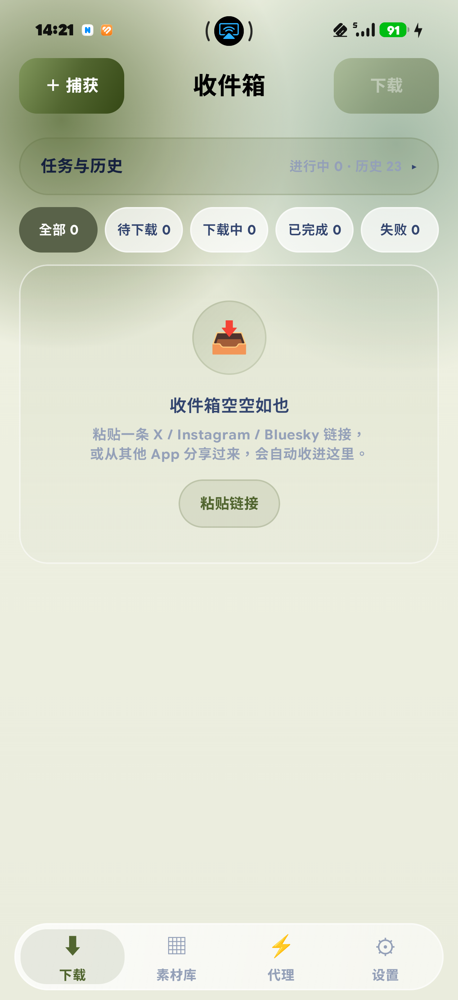

<div align="center">

# Media Downloader · 媒体下载器

**X (Twitter) / Instagram / Bluesky 图片视频下载器 — Android 原生应用**

Kotlin 2.0 · Jetpack Compose · 内嵌 yt-dlp · 代理自动优选 · 系统分享直达下载

[](#)
[](#)
[](#)
[](#)
[](LICENSE)

</div>

---

## 📸 应用预览

| 收件箱（批量队列） | 任务与历史 | 设置 |
|:---:|:---:|:---:|
|  |  |  |
| **素材库 · 时间视图** | **两级筛选** | **一键回跳原帖** |
|  |  |  |

> 界面采用 **iOS 26 Liquid Glass × 莫奈取色** 设计语言：玻璃卡片浮于极光渐变之上，悬浮胶囊底栏，支持 Android 12+ 壁纸动态取色与 8 种预设种子色。

---

## ✨ 功能特性

### 平台支持

| 平台 | 单帖下载 | 主页批量 | 免登录 | 备注 |
|---|:-:|:-:|:-:|---|
| **X / Twitter** | ✅ | ⚠️ 实验性 | 单帖可 | 受限内容需 Cookie；主页批量走 syndication 接口 |
| **Instagram** | ⚠️ 实验性 | ⚠️ 实验性 | ❌ 需 Cookie | 移动 API，Cookie 会过期需重抓 |
| **Bluesky** | ✅ | ✅ | ✅ | 公共 API，视频走 getBlob 直下 |

### 核心能力

- **🔗 系统分享直达**：在任意 App 点「分享」选本应用 → 自动捕获链接 → 自动下载，全程零点击（可关闭）
- **📥 收件箱批量队列**：链接先捕获进收件箱（带作者 / 文案 / 预览图），可单条或自选批量下载；按 URL 去重，失败可重试
- **📚 素材库**：两级筛选（来源 / 分组 / 类型）+ 时间网格 / 作者手风琴视图，时间线按下载时间倒序；统计面板，全屏图片查看，应用内视频播放（Media3）；下载完成自动刷新，顶部胶囊一键跳转查看新素材
- **🗑 回收站**：删除走软删，可恢复或彻底清除；删除时文件先删成功才清数据库记录，失败可重试，另有残留清理兜底
- **⚡ 代理自动优选**：直连 / 手动 / 端口扫描 / Clash 配置导入（文件·粘贴·URL 订阅），测速评分自动选路，周期复测自动切换；主测速源异常自动换备用源重测
- **🛡 Root 代理探测**（可选）：root 设备自动识别本机透明代理 / sing-box·clash 类内核入站并参与优选；非 root 完全静默
- **🐍 内嵌 yt-dlp 引擎**：Chaquopy 内嵌 Python 3.12 + yt-dlp（1083 模块），原生提取失败自动降级重试，Cookie 自动喂入
- **🍪 浏览器容器登录**：内置 WebView 登录 X / Instagram，自动抓取 Cookie（含 HttpOnly），替代手动 DevTools 抠 Cookie
- **🔄 本地导入 / 共享目录**：扫描下载目录重登记；「同步其他目录」以共享引用模式接入任意文件夹（如 Edqiu 下载目录）——文件留原位、仅登记元数据，文件名 / sidecar 自动识别归并，导入时间按文件真实落盘时刻沉位，绝不霸占时间线顶部

---

## 🏗 项目架构

项目包含两端：**Android App（主力，功能完整）** 与 **PC 桌面版（前身，功能已被覆盖大半）**。

```
媒体下载器/
├── android-app/          # Android 主力端（本 Release 发布对象）
│   └── app/src/main/java/...
│       ├── MainActivity.kt      # 单 Activity 入口：SEND 分享 / 剪贴板捕获
│       ├── Store.kt             # 全局单例：DB / Prefs / 代理 / 任务 / 图片加载器
│       ├── IosUI.kt             # 设计系统全量组件（玻璃卡片 / 底栏 / 徽章…）
│       ├── Extractors.kt        # 平台提取：fxtwitter / Bluesky API / IG 移动 API / syndication
│       ├── TaskManager.kt       # 收件箱捕获 → 队列（2 worker）→ 下载 → 入库
│       ├── YtDlp.kt             # Chaquopy 桥：原生失败降级内嵌 yt-dlp
│       ├── ProxyManager.kt      # 候选检测 / 测速评分 / 优选循环
│       ├── RootProxy.kt         # Root 代理探测：透明代理 / 内核入站识别（非 root 静默）
│       ├── VideoThumbs.kt       # 视频抽帧缩略图（fd 直传，兼容 ColorOS 16）
│       ├── MediaFiles.kt        # 文件删除 / 残留清理 / 回收站物理删除
│       ├── ClashConfig.kt       # Clash YAML / base64 订阅最小解析
│       ├── ShareIn.kt           # 分享文本 → 链接提取（含 t.co 短链跟随）
│       ├── CookieLoginActivity.kt  # WebView 容器登录抓 Cookie
│       ├── Db.kt                # SQLite v5：authors/posts/media/tasks/proxy/inbox
│       └── Background.kt        # 前台下载服务 + WorkManager 周期优选
│   └── app/src/main/python/     # yt-dlp 纯源码直放（engine.py 提取引擎）
├── backend/              # PC 桌面版（Python 3.14 + FastAPI:8765 + SQLite WAL + gallery-dl）
├── run_server.py         # PC 版启动器
└── docs/                 # 开发文档（HANDOFF / TASKS / UI_DESIGN / RESEARCH）
```

### 核心数据流

```
分享(SEND) / 剪贴板 / 手动粘贴
        │ 链接提取（t.co 跳转跟随）
        ▼
收件箱捕获 ──► 异步拉取作者/文案/预览图
        │ 批量下载
        ▼
任务队列（2 worker，可取消）
        │ 原生提取（主路由失败自动换备用）
        │   └─ 失败且为 twitter/instagram → 内嵌 yt-dlp（cookies.txt + 代理路由）
        ▼
逐文件下载（单文件独立容错，成功路由记忆）
        ▼
入库（(post, index) 唯一约束天然去重）──► 素材库呈现
```

---

## 🔄 历史修改

| 阶段 | 内容 |
|---|---|
| **M0–M5**（PC 版） | 项目初始化 → 代理模块 → 下载模块（gallery-dl）→ 素材库 → 原生 HTML/CSS/JS + Vue3 前端（vendored 无构建）→ 联调交付 |
| **M6** | Android 端立项：Kotlin + Jetpack Compose 单 Activity 架构，基础下载链路 |
| **M7**（09-05） | 主力端强化：素材库双视图、回收站、批量操作、全屏查看 / 播放 |
| **M8**（09-05） | 对标同类产品强化：收件箱预览图（DB v3）、视频抽帧缩略图、任务与历史子页 |
| **M9**（09-06） | **无感分享链路闭环**：SEND 直达后台下载 + 悬浮胶囊通知（3.5s 淡出）+ 系统通知兜底；真机实测 X 主页 13 文件、Bluesky 67 文件 |
| **T8.8**（09-07） | **内嵌 yt-dlp**：Chaquopy 16.0.0 打包 Python 3.12 + yt-dlp 全量源码（APK 55.8MB），受限内容自动降级重试 |
| **Cookie 容器**（09-08） | WebView 容器登录 X / IG 自动抓 Cookie；修复 Compose `AndroidView` 承载 WebView 的全链高度归零问题（换传统 View 体系） |
| **莫奈取色重构**（09-09） | 壁纸免权限取色 + 多点位采样派生三 seed（主/辅/第三色独立 TonalPalette）；取色缓存解决 ColorOS 16 重启后壁纸缓存未就绪导致取色失效 |
| **素材库定型**（09-10） | **两级筛选**（来源 / 分组 / 类型，时间·日期手风琴 + 作者手风琴）；时间线按下载时间倒序；视频封面 ColorOS 16 修复（fd 直传 + 启动批量回填）；删除链路重构（文件删成功才清 DB + 残留清理兜底）；素材库下载完成即时刷新 + 「查看素材」胶囊 |
| **共享目录 & Root 探测**（09-10） | Edqiu 共享目录接入（共享引用模式：sidecar / 文件名 / 手动三级识别，导入时间=文件真实落盘时刻，App 外文件删除保护）；Root 代理探测（su 会话识别透明代理与内核入站，实测 KernelSU + NetProxy-Magisk）；测速主源 0 字节自动换备用源重试 |

---

## 🚀 改进内容

- **下载可靠性**：提取与下载双路由回退；单文件失败不毁任务；每路由 2 次重试 + 成功路由记忆；中断任务重启不悬挂
- **三层去重**：收件箱按 URL → 媒体按 (post, index) 唯一约束 → 本地导入按 source_url
- **代理优选算法**：评分 = 速度 ÷ (1 + 延迟/300)；全挂 20s 激进重试，正常按间隔全量复测自动切换
- **体验**：分享零点击直达；剪贴板前台自动捕获；长按批量删除走回收站可恢复
- **体积与性能**：无导航库、无 DI 框架、无冗余依赖；Coil 单例走代理路由；缩略图本地缓存
- **稳定性**（踩坑固化）：tab 切换销毁 remember → 草稿状态提升 Store；Dialog 全屏必须关 `platformDefaultWidth`；WebView 容器一律传统 View 体系

---

## 📥 使用说明

### 安装

1. 从仓库 [`release/`](release) 目录下载最新 APK（debug 构建，约 54MB），或前往 [Releases](../../releases)
2. 安装需 Android 8.0（API 26）及以上
3. 首次启动授予通知权限（后台下载进度通知）

### 快速上手

- **分享下载**：在 X / Instagram / Bluesky App 里点「分享」→ 选「媒体下载器」→ 自动进收件箱并开始下载
- **粘贴下载**：复制链接后打开 App（前台自动捕获剪贴板），或在下载页点「粘贴链接」
- **批量下载**：收件箱长按进入多选，或点「捕获 / 下载」处理全部
- **素材管理**：底部「素材库」按时间 / 作者浏览，长按批量删除（进回收站可恢复）

### Cookie 配置（可选，解锁受限内容）

设置 → 「X / Twitter Cookie」或「Instagram Cookie」→ 选择**浏览器登录并自动抓取**（内置 WebView 容器，登录成功自动填入），也可手动粘贴 Cookie 文本。

> X 受限内容需要 `auth_token + ct0`；Instagram 需要 `sessionid`。Cookie 过期后重新抓取即可。

### 代理配置

设置 → 「代理优选」：支持直连 / 手动填入（http / socks5，含 user:pass 认证）/ 端口扫描 / **导入 Clash 配置**（文件、粘贴、URL 订阅均支持，base64 订阅自动解码）。导入后自动测速评分并优选，全程自动切换无需干预。

> ⚠️ 加密协议节点（ss / vmess / trojan）暂不支持，导入时自动跳过。

### 注意事项

- 内嵌 yt-dlp 通道仅提取 http 渐进式直链（HLS / DASH 自适应流跳过）
- Instagram 接口为非官方移动 API，属实验性功能
- Cookie 容器登录走系统网络（不受 App 内代理控制），需系统级 VPN / 全局代理配合

---

## 🔨 从源码构建

```bash
# 环境要求：JDK 21 + Android SDK (API 35) + Gradle 8.9（wrapper 自带）
cd android-app
./gradlew assembleDebug
# 产物：app/build/outputs/apk/debug/app-debug.apk
```

- 国内网络建议在 `settings.gradle.kts` 保留阿里云镜像配置
- 中文项目路径需 `gradle.properties` 中 `android.overridePathCheck=true`（已配置）
- yt-dlp 源码已直放 `src/main/python/`，无需构建期 pip 安装

---

## 📄 License

[Apache License 2.0](LICENSE)
